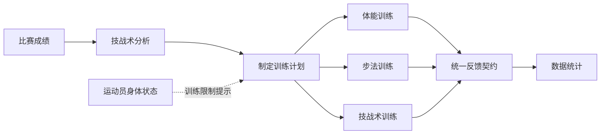

# 乒乓球运动员综合训练监控管理系统模块闭环改造实施指导

> 适用对象：负责集成、比赛成绩、训练计划、导航、体能训练、伤病康复、统计与导入导出的开发 agent。
>
> 本文以当前代码和数据库为准。实施时先阅读本文件，再读取对应模块的现有代码和测试；不得以“统一重构”为由覆盖其他成员已完成的模块。

## 1. 改造目标与范围

系统应从平铺的功能集合，调整为能在少年乒乓球训练场景中跑通的业务闭环：



本轮要完成的是闭环的导航、追溯关系、数据契约、页面框架和兼容层，不是凭常识补造乒乓球专项训练处方。具体专项训练内容由对应成员按已确认资料继续实现。

必须达成的业务结果：

1. 教练从比赛成绩看到可分析的比赛，完成技战术分析后，才可以把该比赛作为普通改进计划的依据。
2. 一份训练计划拆分为体能、步法、技战术三类可执行项目，而不是把所有内容放入一个自由文本字段。
3. 三类执行模块都能追溯到同一个 `plan_item_id`，并将公共反馈传给数据统计模块。
4. 伤病记录和康复跟踪在导航中合并为“运动员身体状态”的两个子模块，数据链路保持不变。
5. 既有步法训练、技战术训练模块及其历史数据保持可用；不得重建、替换或清空。

## 2. 业务标准与禁止事项

### 2.1 标准来源登记是前置门槛

专项规则的来源优先级固定如下：

1. 课程教师或专项负责人确认的原书页码、章节和适用对象。
2. 《乒乓球技战术分析理论与实践》，肖毅编，科学出版社，2024 年版，ISBN `9787030780805` 的可核验原文。
3. 项目根目录的 [技战术评估指标.docx](</C:/Users/ztwx4/Desktop/乒乓球运动员综合训练监控管理系统/技战术评估指标.docx>)。
4. 当前项目的 SQL、页面文案和演示数据。

在 `docs/技战术标准来源登记表.md` 中逐条记录：标准名、书名、作者/主编、出版社、版本、章节、页码、适用对象、单打/双打、核验人、核验时间、启用状态。资料没有页码时，状态必须为“待核验”。

`技战术评估指标.docx` 内含无页码的说明性文字，不能据此证明书籍原文，也不能把其中未给出处的阈值、TE 常量或少年组适用性直接上线。

### 2.2 当前允许实现的技战术分析边界

本地资料可作为录入与计算框架的内容：

| 方法 | 当前可实现内容 | 当前禁止内容 |
|---|---|---|
| 三段法 | 发抢、接抢、相持的得分数和失分数录入；比率计算；教练人工结论 | 未核验阈值的正式评级；自动生成训练处方 |
| 四段法 | 仅在数据模型中预留 `analysis_method`；资料中已出现的板次说明可作为待核验备注 | 启用评分、排行或自动评价 |
| TE 技术效率值 | 不实现 | 写死 A、B、C 常量，或显示 TE 数值和等级 |

三段法的计算服务必须是纯函数，规则如下：

```text
段得分率 = 段得分 / (段得分 + 段失分) * 100%
段使用率 = (段得分 + 段失分) / 全局总得分数 * 100%
```

实现要求：

- 段得分、段失分只能是非负整数。
- 某段分母为 `0` 时保留原始计数，得分率和使用率返回空值，并显示“无该段数据”；绝不能显示 `0%`、`100%` 或给出等级。
- “全局总得分数”的来源必须保存且可追溯。只有三段统计完整覆盖该场比赛时，才能使用三个段的得失分总和作为分母；否则由书籍原文和教练确认的定义决定，不得自行推断。
- 评价等级只能在关联的 `tactical_standard_version.verification_status = verified` 且该版本提供完整阈值时计算；其他情况 `evaluation_level` 必须为空。
- 不从胜负、局分或总比分反推出发抢、接抢、相持表现。

### 2.3 绝对禁止项

- 不新增没有来源的专项指标、权重、等级、训练剂量、医学限制或“正常范围”。
- 不把成年、专业队或不明年龄组标准直接套用于少年运动员。
- 不把“体能测试记录”改名后伪装成“体能训练执行记录”。
- 不把旧“专项技术”混合记录机械拆分或迁移为步法、技战术新执行记录。
- 不删除旧表、旧记录或旧 URL；先新增闭环数据，再做兼容跳转和只读历史访问。
- 不修改数据统计的现有图表业务；本轮只提供它后续接入的公共反馈契约。

## 3. 当前工程事实与模块兼容边界

当前为 Flask 单体应用，路由主要集中在 [app.py](/C:/Users/ztwx4/Desktop/乒乓球运动员综合训练监控管理系统/app.py)。`NAV_ITEMS` 仍是平铺入口，根路由 `/` 仍渲染综合看板；这两处是导航改造的主要入口。

### 3.1 已完成模块，按“接入而非重做”处理

步法训练和技战术训练已经完成并同步到当前工程。以下文件归专项模块负责人所有：

| 能力 | 当前路由/端点 | 关键文件 | 当前数据表 |
|---|---|---|---|
| 步法训练 | `/training/footwork` / `training.footwork` | `templates/training/footwork.html`、`repositories/training_repository.py` | `footwork_training` |
| 技战术训练 | `/training/technique-tactic` / `training.technique_tactic` | `templates/training/technique_tactic.html`、`repositories/training_repository.py` | `technique_tactic_training`、`technique_tactic_landing` |
| 两模块字典 | 同上 | `repositories/training_repository.py` | `sys_dictionary` |

相关 SQL 为 [member10_footwork_technique.sql](/C:/Users/ztwx4/Desktop/乒乓球运动员综合训练监控管理系统/sql/member10_footwork_technique.sql)。它已经定义了步法类型、技战术分类、落点分布及专项反馈字段。集成人员不得：

- 新建第二套 `footwork_training`、`technique_tactic_training`、字典表或重复路由。
- 重命名已有端点、字段、字典编码、模板路径，或删除专项负责人已有的校验和导入导出逻辑。
- 把 `on_table_rate`、落点、发球频率等既有字段解释成未经书籍核验的比赛技战术评价标准。

本轮允许的最小接入修改，必须先由模块负责人确认后实施：

1. 为现有两张执行表新增允许为空的 `plan_item_id` 外键。
2. 页面仅增加“关联计划项目”上下文、计划来源摘要和公共反馈映射，不重写原有录入表单与专项字段。
3. 旧记录的 `plan_item_id` 保持 `NULL`，页面标记为“历史独立记录”，不尝试补配计划。

### 3.2 其他既有模块

| 模块 | 当前端点 | 本轮处理 |
|---|---|---|
| 训练计划 | `training.plans` | 增加比赛来源、计划项目、状态和详情追溯 |
| 体能测试 | `fitness.tests` | 保留旧记录和页面；新增体能训练框架，不把旧测试当训练执行 |
| 伤病记录 | `injuries.list` | 保持业务逻辑，只调整导航父级和计划提示 |
| 康复跟踪 | `rehab.list` | 保持 `injury_followup -> injury_record` 关联，只调整导航父级 |
| 比赛成绩 | `matches.list` | 增加分析、来源追溯和“据此制定计划”入口 |
| 数据统计 | `stats.dashboard` | 不改图表，只冻结公共反馈读取契约 |
| 导入导出 | `stats.import_export` | 保持独立入口，补模板版本和追溯字段要求 |
| 系统配置 | `settings.dictionary` | 不再作为一级业务模块；仅管理员从“用户权限/系统维护”进入 |

## 4. 目标导航与首页行为

导航必须按业务而非历史开发分工分组。一级模块的显示顺序固定为：

```text
训练业务
  1. 比赛成绩
  2. 训练计划
  3. 体能训练
  4. 步法训练
  5. 技战术训练

人员与状态
  6. 运动员档案
  7. 教练员信息
  8. 运动员身体状态
       - 伤病记录
       - 康复跟踪

数据与管理
  9. 数据统计
 10. 导入导出
 11. 用户权限（仅管理员）
       - 系统维护/数据字典（仅管理员）
```

实施规则：

- 删除“综合看板”一级入口；`/` 在登录后重定向到 `matches.list`，不再渲染 `templates/index.html`。
- “专项技术录入”“专项技术查询”不能再次作为一级菜单。历史 URL `/training/records`、`/training/training_record` 继续保留 301 跳转到现有 `training.technique_tactic`，当前工程已具备该兼容行为，不能回退。
- 导航显示“体能训练”，但旧 `fitness.tests` 只作为历史体测访问。新增框架端点建议为 `fitness.training`，路径 `/fitness/training`；上线后菜单指向新框架。
- “运动员身体状态”是非叶子父级，不直达独立 CRUD 页面。父级在任一子页面激活，子项顺序必须为“伤病记录、康复跟踪”。
- “系统配置”不出现在普通业务导航；数据字典和数据库维护只由管理员通过“用户权限/系统维护”访问，后端 URL 权限不可只靠隐藏菜单实现。
- 将当前 `NAV_ITEMS` 更换为带 `group`、`children` 和 `roles` 的结构，模板不能再用 `nav_items[:4]` 和 `nav_items[4:]` 的位置切片。

建议导航数据结构：

```python
NAV_GROUPS = [
    {
        "label": "训练业务",
        "items": [
            {"label": "比赛成绩", "endpoint": "matches.list", "roles": {"admin", "coach"}},
            {"label": "训练计划", "endpoint": "training.plans", "roles": {"admin", "coach"}},
            {"label": "体能训练", "endpoint": "fitness.training", "roles": {"admin", "coach"}},
            {"label": "步法训练", "endpoint": "training.footwork", "roles": {"admin", "coach"}},
            {"label": "技战术训练", "endpoint": "training.technique_tactic", "roles": {"admin", "coach"}},
        ],
    },
]
```

其余两个分组使用同样结构；身体状态项必须包含 `children`。在 Flask 的 `context_processor` 中按角色过滤导航，模板负责按分组渲染并依据当前 endpoint 判断父、子项激活状态。

## 5. 数据关系和状态约束

### 5.1 新增闭环数据对象

新增 SQL 统一放入 `sql/workflow_refactor.sql`，以新增表、索引和可重复执行的迁移为主。MySQL 5.5 不支持可依赖的 `CHECK` 约束、JSON、CTE、窗口函数；数值、状态和日期校验必须同时在 Flask 服务层和测试层实现。

| 对象 | 关键字段 | 约束与用途 |
|---|---|---|
| `tactical_standard_version` | `standard_name`、`method_code`、`source_location`、`applicable_group`、`verification_status` | 记录标准来源与核验状态；不在表中填补缺失阈值 |
| `match_tactical_analysis` | `match_id`、`standard_version_id`、`analysis_method`、`version_no`、`status`、`coach_summary` | 一场比赛可以有版本化分析；确认前不能作为普通比赛改进计划来源 |
| `match_phase_stat` | `analysis_id`、`phase_code`、`points_won`、`points_lost`、`scoring_rate`、`usage_rate`、`evaluation_level` | `(analysis_id, phase_code)` 必须唯一；无核验标准时等级为空 |
| `training_plan_source` | `plan_id`、`source_type`、`match_analysis_id`、`injury_record_id`、`source_summary` | 将计划与比赛分析、身体状态或阶段安排明确关联 |
| `training_plan_item` | `plan_id`、`module_type`、`item_title`、`target_description`、`planned_sessions`、`planned_minutes`、`intensity`、`status` | 训练计划的最小可执行单元；`module_type` 仅为 `fitness`、`footwork`、`technique_tactic` |

新增索引至少包括：

```sql
UNIQUE KEY uk_analysis_phase (analysis_id, phase_code)
UNIQUE KEY uk_analysis_version (match_id, version_no)
KEY idx_plan_item_module_status (module_type, status)
KEY idx_plan_source_analysis (match_analysis_id)
```

外键删除策略不得让删除比赛、计划或伤病记录静默删除闭环依据。优先用 `RESTRICT` 或软删除；先在测试环境验证，再写入正式迁移脚本。

### 5.2 业务状态机

| 对象 | 合法状态 | 关键规则 |
|---|---|---|
| 比赛分析 | 草稿、已确认、已作废 | 已确认分析可发起计划；重新分析增加 `version_no`，不覆盖旧分析 |
| 训练计划 | 草稿、已发布、执行中、已完成、已取消/已终止 | 未发布计划不下发；没有计划项目不能发布 |
| 计划项目 | 待执行、执行中、已完成、未完成、已取消 | 只属于一个计划；完成必须有对应执行记录或明确反馈 |
| 伤病记录 | 治疗中、康复中、已恢复 | 沿用现有伤病模块与触发器；康复跟踪必须关联伤病记录 |

计划来源校验伪代码如下：

```python
def validate_plan_source(plan, source):
    if source.type == "match_analysis":
        assert source.analysis.status == "confirmed"
        assert source.analysis.match.athlete_id == plan.athlete_id
    elif source.type == "injury_record":
        assert source.injury_record.athlete_id == plan.athlete_id
    elif source.type == "stage_arrangement":
        assert source.source_summary.strip()
    else:
        raise ValidationError("不支持的计划来源")
```

比赛来源是默认且优先的制定路径。确有阶段安排或身体状态来源时允许建计划，但必须显式选择来源类型并由教练填写依据说明，不能以空来源绕过追溯。

### 5.3 三个执行模块的公共反馈契约

数据统计后续只读取公共字段，不依赖每个专项模块的内部表结构。先冻结以下契约，统计页面本轮不改：

| 字段 | 说明 |
|---|---|
| `execution_id` | 原执行记录主键 |
| `module_type` | `fitness`、`footwork`、`technique_tactic` |
| `plan_item_id` | 对应计划项目；历史独立记录可为空 |
| `plan_id` | 由计划项目关联得到，禁止手工不一致写入 |
| `athlete_id` | 运动员 ID，必须与计划项目一致 |
| `coach_id` | 执行或反馈录入人 |
| `executed_at` | 执行日期/时间 |
| `execution_status` | 已完成、未完成等统一状态 |
| `feedback_summary` | 教练确认的定性反馈；不代替专项指标 |
| `updated_at` | 增量统计读取时间 |

待三个模块负责人确认后，再为新记录增加 `plan_item_id` 并实现 `v_training_execution_feedback` 视图。视图应使用 `UNION ALL` 输出上述字段；步法、技战术特有字段仍留在各自业务表，体能训练由负责成员映射。统计模块在契约冻结前不能直接读取临时字段。

## 6. 分阶段修改任务

### 阶段 0：基线与协作冻结

1. 记录 `git status --short`，不处理与本任务无关的已有改动。
2. 将现有步法、技战术路由、模板、仓储和 SQL 列为受保护文件；只允许模块负责人或经其确认的最小接口提交。
3. 在开发数据库记录旧表行数：`match_record`、`training_plan`、`fitness_report`、`technical_record`、`footwork_training`、`technique_tactic_training`、`injury_record`、`injury_followup`。
4. 建立 `docs/技战术标准来源登记表.md`，将未核验项目明确标记，不能用“以后再补”替代来源状态。

验收：可以复现当前页面和现有测试；没有修改步法、技战术业务逻辑。

### 阶段 1：导航、首页和权限入口

修改文件：

- `app.py`
- `templates/base.html`
- `templates/index.html`（仅保留回滚用途，不再作为首页）
- `templates/auth/users.html`
- `templates/settings/dictionary.html`
- 新增 `tests/test_navigation_structure.py`

操作要求：

1. 先写测试，断言综合看板不在导航、目标模块顺序正确、教练不可见用户权限、身体状态有两个子项。
2. 在 `app.py` 将根路由改为 `redirect(url_for("matches.list"))`；不要删除 `build_home_dashboard_data()`，留待后续清理。
3. 用分组导航替换 `NAV_ITEMS` 平铺和位置切片；模板不得渲染隐藏但可访问的管理菜单。
4. `settings.dictionary` 后端继续保持管理员权限，并由用户权限页提供“系统维护”入口。
5. 运行 `pytest tests/test_dashboard.py tests/test_security_hardening.py tests/test_navigation_structure.py -q`。

验收：登录后进入比赛成绩；没有综合看板、专项技术录入、专项技术查询、体能测试、系统配置这五个一级菜单名称。

### 阶段 2：比赛成绩到技战术分析

修改或新增文件：

- `app.py` 中 `matches_bp` 路由及服务函数，或在不破坏 `/matches/` 的前提下抽出独立服务模块
- `templates/matches/list.html`
- 新增 `templates/matches/detail.html`
- 新增 `templates/matches/analysis_form.html`
- `sql/workflow_refactor.sql`
- 新增 `tests/test_match_tactical_analysis.py`

操作要求：

1. 保留比赛基本信息 CRUD。列表增加“待分析/已分析”状态和详情入口，不删原成绩数据。
2. 分析表单只输入标准版本、分析方法、三段得分/失分和教练人工结论。不得在表单中预置训练建议。
3. 纯计算函数必须覆盖：正常值、负数、非整数、零分母、未核验标准无等级、分析版本递增。
4. 比赛详情同时展示基本成绩、分析版本、标准核验状态、关联计划；提供“依据本场比赛制定训练计划”。
5. 仅已确认分析可以填入普通改进计划来源；草稿分析只允许继续编辑或作废。

验收：仅有胜负和比分时系统不能声称运动员在哪一段存在问题；无来源标准时也不能显示“优秀/良好/及格”。

### 阶段 3：训练计划拆分与来源追溯

修改或新增文件：

- `templates/training/plans.html`
- `templates/training/plan_form.html`
- 新增 `templates/training/plan_detail.html`
- `app.py` 中训练计划路由/校验，或新建专用服务模块
- `sql/workflow_refactor.sql`
- 新增 `tests/test_match_plan_workflow.py`
- 新增 `tests/test_training_plan_items.py`

操作要求：

1. 训练计划表单增加来源类型、来源分析、依据摘要、计划名称、目标、状态；保留原有教练、运动员和日期校验。
2. 从比赛详情进入表单时，预填比赛、分析和运动员；用户不得替换为其他运动员。
3. 一份计划可有多个 `training_plan_item`，每个项目只能选择体能、步法、技战术之一。
4. 项目标题、目标、次数、时长、强度由教练填写；不得从比赛分段分析自动生成训练项目或专项剂量。
5. 已发布计划的项目才可被执行模块读取；所有项目结束后计划才可正常标记已完成。
6. 对存在活跃伤病或康复状态的运动员只显示现有训练限制和人工确认提示，不生成医疗建议或自动阻止规则。

验收：可以从已确认比赛分析建立计划，计划详情能反向看到来源比赛，并按三个模块显示项目及反馈状态。

### 阶段 4：三个执行模块的接入策略

#### 4.1 体能训练：只建框架

1. 新增 `fitness.training`（建议路径 `/fitness/training`）和轻量模板，显示“待执行、执行中、已完成”的体能计划项目。
2. 现有 `/fitness/tests`、`fitness_report` 和 `templates/fitness/tests.html` 保持为旧体测数据访问，不从一级菜单进入。
3. 框架只包含计划项目、空状态、计划来源摘要和接口占位；不新增体能指标、评分标准或训练处方。
4. 为体能负责人预留 `plan_item_id`、公共反馈契约和历史数据兼容说明。

#### 4.2 步法训练：已有模块只做契约接入

1. 菜单继续指向既有 `training.footwork`，路径和模板保持不变。
2. 先新增计划项目读取服务和 `plan_item_id` 对接设计，不在集成分支改写 `footwork.html` 的字段、导入流程、查询条件或仓储实现。
3. 由步法模块负责人在其分支将新训练记录关联到步法计划项目；历史记录显示为“未关联计划的历史记录”。
4. 反馈映射只输出公共字段；现有 `duration_minutes`、`set_count`、`note` 仍是步法模块内部业务数据。

#### 4.3 技战术训练：已有模块只做契约接入

1. 菜单继续指向既有 `training.technique_tactic`，路径和模板保持不变。
2. 不再创建“专项技术录入/查询”页面或第二套技战术训练蓝图。
3. 由技战术模块负责人确认后，新增 `plan_item_id` 关联；既有 `multi_ball_count`、`serve_frequency`、`on_table_rate`、落点及定性评价字段不改名、不迁移、不自行定义新的标准解释。
4. 比赛详情可以只读显示来源分析摘要，但不能把未核验的阈值、TE 或自动处方塞进技战术训练页。

验收：三个模块只看到本模块类型、已发布计划的项目；步法和技战术模块的现有 CRUD、分页、导入导出和 SQL 初始化不回归。

### 阶段 5：身体状态模块分组

修改文件：

- `templates/base.html`
- `templates/injuries/list.html`
- `templates/rehab/list.html`
- 导航上下文代码
- `tests/test_injuries.py`

操作要求：

1. 只改变导航和上下文，不改写伤病、康复的现有核心逻辑。
2. `injury_followup.injury_record_id` 必须始终关联一个伤病记录；不能创建脱离伤病的康复记录。
3. 继续使用 [member8_injury_records.sql](/C:/Users/ztwx4/Desktop/乒乓球运动员综合训练监控管理系统/sql/member8_injury_records.sql) 的数据表、触发器和存储过程。
4. 计划页显示当前伤病状态和既有训练限制；恢复结论由教练/医务人员确认，系统不作医学判断。

验收：两个页面分别仍可 CRUD 和追溯，导航只在“运动员身体状态”下展示它们。

### 阶段 6：导入导出、统计和历史兼容

修改或新增文件：

- `templates/stats/import_export.html`
- `sql/workflow_refactor.sql`
- 新增 `templates/training/legacy_records.html`（如需要独立只读说明页）
- 新增 `tests/test_legacy_route_redirects.py`
- 更新 `tests/test_training_records.py`、`tests/test_fitness.py`、`tests/test_stats.py`

操作要求：

1. 所有新导入模板必须包含模板版本与模块类型。比赛分析模板至少有 `match_id`、分析方法、标准版本、各段得分/失分、教练结论；不允许导入系统推断的等级。
2. 旧专项技术模板标记为历史模板，不可作为新步法、技战术执行的通用导入模板。
3. 导出闭环数据时保留 `match_id`、`analysis_id`、`plan_id`、`plan_item_id`、`execution_id`；批量导入必须返回成功数、失败数、行号和原因。
4. 所有旧 URL 在至少一个发布周期内可到达新入口或历史只读页，不能 404。
5. 迁移前后比较基线行数。旧专项、体测、伤病、比赛和计划数据不得减少；语义不一致的数据只读保留，不自动迁移。
6. 数据统计本轮不改图表和口径，只验收它可以在后续读取冻结的 `v_training_execution_feedback` 契约。

## 7. 测试与验收清单

每阶段先写失败测试，再实现最小代码使测试通过。不要用 `skip`、宽松断言或删除旧测试来掩盖兼容问题。

| 测试文件 | 必测行为 |
|---|---|
| `tests/test_navigation_structure.py` | 无综合看板；模块顺序；身体状态下拉；管理员与教练权限 |
| `tests/test_match_tactical_analysis.py` | 三段计数、零分母、来源版本、未核验不评级、版本化 |
| `tests/test_match_plan_workflow.py` | 已确认分析发起计划、运动员一致性、反向追溯 |
| `tests/test_training_plan_items.py` | 三类项目、空计划不可发布、项目和计划状态流转 |
| `tests/test_execution_module_frames.py` | 体能框架与既有步法/技战术入口可访问，且项目按模块隔离 |
| `tests/test_legacy_route_redirects.py` | 旧专项和旧体测 URL 不 404，历史数据可读 |
| `tests/test_injuries.py` | 伤病与康复关联、现有触发器和状态回算无回归 |
| `tests/test_security_hardening.py` | 教练不能直接访问用户权限、系统维护和标准版本维护 |

最终必须执行：

```powershell
pytest -q
rg -n "综合看板|专项技术录入|专项技术查询|体能测试|系统配置" app.py templates tests
```

文案扫描的命中只允许出现在历史兼容说明、迁移测试或旧数据只读标识中，不能出现在一级业务导航或新建表单标题中。

最终人工演示按以下路径完成：

1. 教练登录后进入比赛成绩。
2. 录入比赛基本结果，再录入三段原始得分/失分和教练结论。
3. 确认分析后，从该比赛创建训练计划。
4. 在同一计划下添加体能、步法、技战术项目并发布。
5. 进入体能训练框架、既有步法训练和既有技战术训练，分别验证计划项目可被正确识别或处于已约定的待接入状态。
6. 展示“运动员身体状态 -> 伤病记录 -> 康复跟踪”的导航与数据关联。
7. 验证反馈具备统一追溯字段，统计模块无需理解各专项内部字段。

## 8. 合并顺序与冲突控制

按以下顺序合并，避免高冲突文件互相覆盖：

1. 标准来源登记、数据模型和公共反馈契约。
2. 导航、首页重定向和权限入口。
3. 比赛分析与比赛到计划的关联。
4. 训练计划项目和体能训练框架。
5. 与步法、技战术模块负责人共同完成最小 `plan_item_id` 适配。
6. 身体状态分组、导入导出兼容、统计契约验证和全量回归。

共享文件责任必须明确：

| 文件/区域 | 唯一集成人 | 其他成员处理方式 |
|---|---|---|
| `app.py` 路由注册、根路由、导航上下文 | 集成人员 | 通过小模块或清晰补丁提交，不整段覆盖 |
| `templates/base.html` | 集成人员 | 仅提供菜单项需求，不并行重写模板 |
| `sql/workflow_refactor.sql` | 数据库负责人 | 统一审核顺序、索引、外键和回滚说明 |
| `repositories/training_repository.py` 与 `member10_footwork_technique.sql` | 步法/技战术负责人 | 只接受经确认的最小适配 |
| `member8_injury_records.sql` | 伤病康复负责人 | 不改动存储过程和触发器语义 |

完成定义：业务上能从比赛依据建立计划、把计划项目交给三类训练模块并追溯反馈；数据上不丢失旧记录；专项和医学规则上没有任何未核验的自动评价或自动处方；工程上现有模块、权限和全量测试均无回归。
